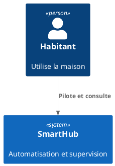

# Documentation — instructions for Copilot coding agent

Follow these conventions when writing or editing pages in the `docs/` directory.

## 1. Tool & rendering pipeline

- **Generator**: [VitePress](https://vitepress.dev/) — Markdown (no custom Vue components needed).
- **Build**: `npm run docs:build` → output in `docs/.vitepress/dist/`.
- **Dev server**: `npm run docs:dev` → `http://localhost:5173/`.
- **Deploy**: GitHub Actions workflow `.github/workflows/deploy-docs.yml` → GitHub Pages.

## 2. Scope & languages

- Default language is **French**.
- French source pages live under `docs/`.
- English pages live under `docs/en/` and should only be edited when you are explicitly asked to translate.

## 3. File structure & naming

```
docs/
├── index.md                   # Landing page (VitePress home)
├── projet/                    # Pages du projet (FR)
│   ├── index.md
│   └── inspiration.md
└── en/                        # English locale
  └── index.md
```

- Use **kebab-case** for file names: `team-grouping.md`, not `teamGrouping.md`.
- Prefer an `index.md` per folder to act as the landing page.
- All content pages must have a `# Titre` as the first heading (after optional frontmatter).

## 4. Writing style

- Write in **French** except for code blocks, which must be in English (e.g. CLI commands, config snippets), or if I explicitly ask you to write in English for a specific page.
- Lead each page with a one-sentence description of what the feature does and **when to use it**.
- Prefer **use-case-driven content**: show a realistic example first, then explain details.
- Every code block must declare its language: ` ```bash `, ` ```typescript `, ` ```json `, etc.
- Use admonitions for important caveats:
  ```markdown
  ::: warning GitHub API limit
  Code search is capped at 1 000 results. See [GitHub API limits](/reference/github-api-limits).
  :::
  ```
- Cross-link using root-relative, extensionless paths when possible: `/projet/` or `/projet/inspiration`.

## 5. Diagrams (Kroki + PlantUML, C4)

- Use **Kroki** to render diagrams from fenced code blocks.
- Prefer **PlantUML** and, when it helps readability, use **C4-PlantUML**.
- Include a short prose introduction **before** each diagram.
- Keep diagrams self-contained: label nodes and arrows.
- If you self-host Kroki, set `KROKI_ENDPOINT` at build time.

Example (C4 context diagram via PlantUML stdlib):



## 6. Assets

- Put images and downloadable files under `docs/public/`.
- Reference them with absolute paths (for example `/images/schema-reseau.png`).
- Always include meaningful alt text for images.

## 7. Validation checklist

Before opening a PR for any docs change:

```bash
npm run docs:build
```

- All internal links must resolve (VitePress reports dead links on build).

