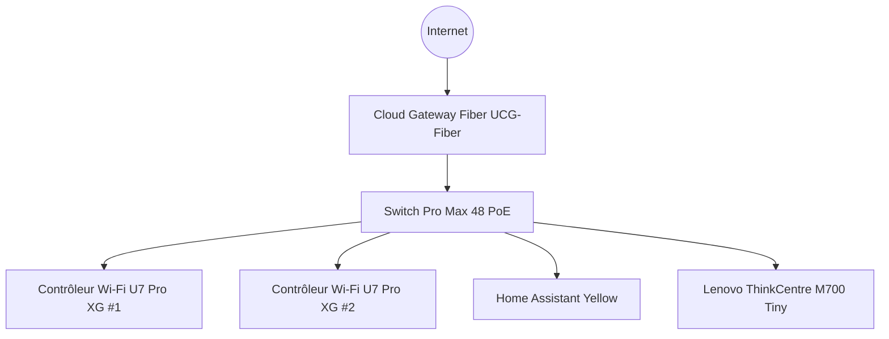

# Appercu du réseau

Voici un schéma simplifié de l'infrastructure réseau :

# Détails de l'infrastructure réeau

L'infrastructure réseau Unifi assure la connectivité et la sécurité de tout le système domotique. Elle repose sur des équipements fiables et performants :

## Passerelle Cloud Gateway Fiber
- **Modèle :** UCG-Fiber (30W) *(à confirmer)*
- **Rôle :** Pare-feu et passerelle centrale. Elle protège le réseau local, filtre le trafic et supervise la sécurité internet/domotique.

## Switch principal Pro Max 48 PoE
- **Modèle :** USW-Pro-Max-48-PoE (720W)
- **Rôle :** Switch principal, alimentation PoE pour tous les équipements réseau. Permet une gestion centralisée et une alimentation fiable des appareils connectés.

## Points d'accès Wi-Fi U7 Pro XG
- **Nombre :** 2
- **Modèle :** U7 Pro XG
- **Rôle :** Points d'accès Wi-Fi très haut débit, couverture optimale et réseau sans fil sécurisé sur tout le site.

Cette base réseau garantit des performances élevées, une sécurité renforcée et une gestion simple pour l'ensemble de l'infrastructure.
