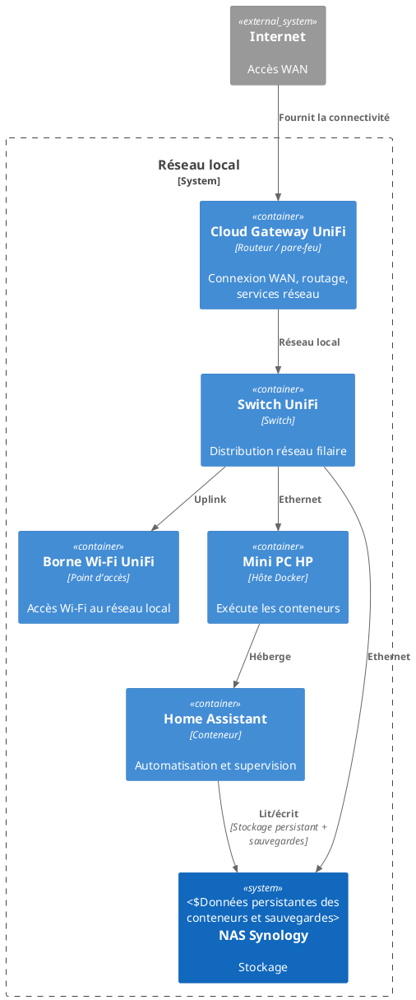

# Infrastructure

Cette section décrit brièvement l’infrastructure (matériel, réseau, stockage) sur laquelle tournent SmartHub et Home Assistant.

## Vue d’ensemble

- **Calcul** : un mini PC HP qui sert d’hôte Docker pour exécuter les conteneurs.
- **Stockage** : un NAS Synology qui héberge les données persistantes des conteneurs et les sauvegardes Home Assistant.
- **Réseau** : une connexion Internet qui arrive sur une Cloud Gateway UniFi, puis distribution via un switch UniFi et une borne Wi‑Fi UniFi.

::: info Détails à venir
Tu détailleras la configuration (Docker, partages du NAS, segmentation réseau, Wi‑Fi) dans des sous-pages dédiées.
:::

## Schéma de l’installation (C4)

Le diagramme ci-dessous montre les éléments principaux et leurs liens : calcul (hôte Docker), stockage (NAS) et réseau (UniFi).

