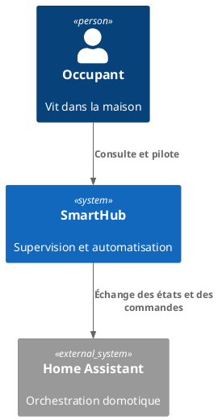
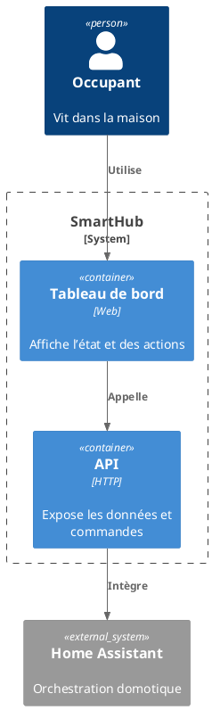
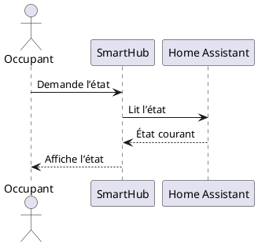

# Démo : diagrammes (Kroki + PlantUML)

Cette page te montre comment écrire des diagrammes _diagram-as-code_ dans SmartHub.

::: info
Les diagrammes sont rendus par **Kroki** depuis des blocs `plantuml`.
Si tu auto-héberges Kroki, tu peux définir `KROKI_ENDPOINT` au moment du build.
:::

## C4 (contexte)

Exemple _fictif_ et volontairement simplifié.

## C4 (conteneurs)

## PlantUML (séquence)

